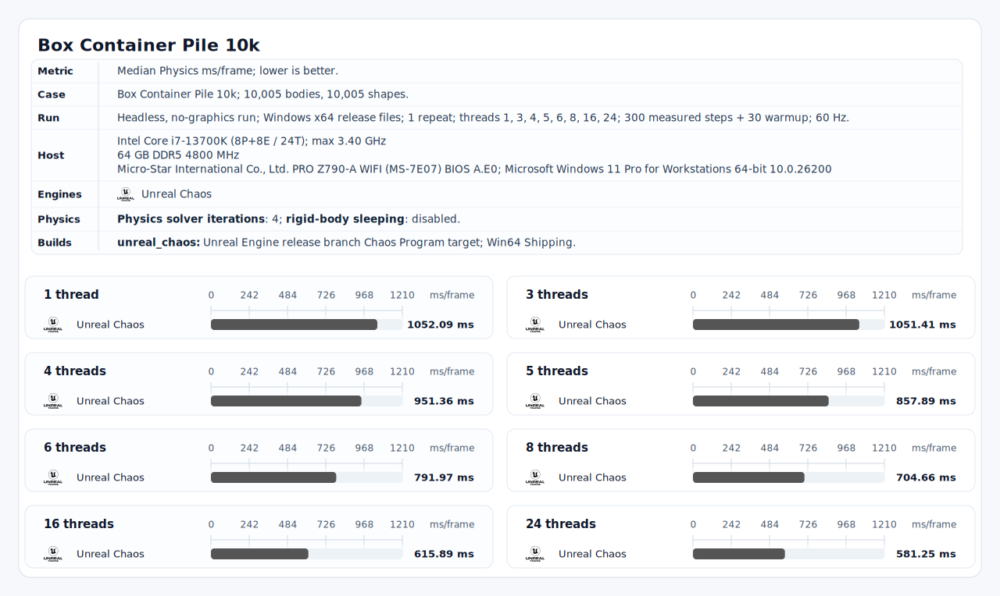

# Physics Arena

Physics Arena runs the same physics scenarios through multiple engines and writes comparable result files. The public path uses the checked-in Windows x64 release packages, so you can run it without building the engines first.

## Quick Start

**Open a shell that can launch the checked-in Windows x64 executables.**

Use Git for Windows Bash, WSL Bash with Windows executable access, or another shell that can run files under `release/windows-x64/`.

**Run the default benchmark.**

```bash
./bench.sh
```

This runs the current default case with the default release engine set. It writes raw data, normalized CSVs, `summary.svg`, `report.md`, and prints the result folder when it finishes.

Thread selection uses baseline checkpoints and adds your host maximum when your machine has more logical threads than the baseline.

**Share your CPU result.**

Commit the new `results/<case>/<cpu>/<run>/` folder from your machine and open a pull request. The goal is a public collection of Physics Arena runs across many CPUs, memory configurations, thread counts, and systems.

Keep the generated folder intact; it contains the manifest, raw evidence, normalized data, chart, and report needed to compare runs cleanly.

Do not update the shared result indexes in benchmark-result pull requests. They are regenerated after result folders are integrated.

**Useful commands**

Run one engine:

```bash
./bench.sh run box-container-pile-10k --engine box3d --repeats 1
```

Run selected engines:

```bash
./bench.sh run box-container-pile-10k --engine bepuphysics2 --engine joltphysics --max-thread-count 4 --repeats 3
```

Run a visual check:

```bash
./bench.sh visual-run box-container-pile-10k --engine unity_physics --thread-count 1 --repeats 1
```

Runs create report files automatically. Refresh an existing result only when you want to re-render it:

```bash
./bench.sh report results/<case>/<cpu>/<run>
```

Regenerate shared result indexes after integrating result folders:

```bash
./bench.sh index
```

## Commands

| Command | What it does |
| :------ | :----------- |
| `./bench.sh` | Runs the current default case with `default_release`. |
| `./bench.sh help` | Prints shell usage and examples. |
| `./bench.sh run <case-slug> ...` | Runs headless engine comparisons. |
| `./bench.sh visual-run <case-slug> ...` | Runs visual output checks through the shared renderer. |
| `./bench.sh report results/<case>/<cpu>/<run>` | Re-renders `summary.csv`, `summary.svg`, and `report.md` for one result folder. |
| `./bench.sh index` | Regenerates shared result indexes from checked-in result manifests. |

Current public case slug:

```text
box-container-pile-10k
```

More cases can be added later without changing the command shape.

## Arguments

| Argument | Works With | Meaning |
| :------- | :--------- | :------ |
| `--engine <id>` | `run`, `visual-run` | Add one engine. Repeat it to run several engines. |
| `--engines <a,b,c>` | `run`, `visual-run` | Add several engines as a comma-separated list. |
| `--engine-set <set>` | `run`, `visual-run` | Use a configured engine set. Defaults to `default_release` for `run` and `default_visual_release` for `visual-run`. |
| `--thread-count <n>` | `run`, `visual-run` | Run one exact thread count. Repeat it for multiple exact counts. |
| `--threads <a,b,c>` | `run`, `visual-run` | Run exact thread counts from a comma-separated list. |
| `--max-thread-count <n>` | `run`, `visual-run` | Run baseline checkpoints up to `n`, plus generated high-thread checkpoints and the effective maximum. Do not combine with `--thread-count` or `--threads`. |
| `--repeats <n>` | `run`, `visual-run` | Number of repeats per engine and thread count. If omitted, the current public case uses 3. |

Engine IDs in the default release set:

```text
box3d joltphysics bepuphysics2 rapier3d avian3d unity_physics physx34 nvidia_physx34 nvidia_physx5
```

`unreal_chaos` is packaged as an opt-in engine and documented below because it is intentionally separate from the official release benchmark.

## Generated Files

Runs write to:

```text
results/<case>/<cpu>/<run>/
```

| File or folder | Contents |
| :------------- | :------- |
| `manifest.json` | Case, engine, host, thread, repeat, and release-file snapshot for the run. |
| `raw/<engine>/t<thread-count>/` | Raw per-engine CSV files used to build the result. Visual runs also include proof JSON files here. |
| `normalized.csv` | Per-repeat rows normalized into one schema. |
| `summary.csv` | Aggregated rows by engine and thread count. |
| `summary.svg` | Chart generated from `summary.csv`. |
| `report.md` | Human-readable report generated from the CSV files. |

## Official Release Benchmark

This is the official Physics Arena 0.1.0 benchmark included with the current release. It was run from the checked-in Windows x64 runners on an Intel Core i7-13700K with DDR5-4800 and thread counts `1,2,3,4,5,6,8,16,24`.

- [Report](results/box-container-pile-10k/intel-core-i7-13700k/2026-07-09_0112_ddr5-4800_threads-1-2-3-4-5-6-8-16-24_r10/report.md)
- [Chart](results/box-container-pile-10k/intel-core-i7-13700k/2026-07-09_0112_ddr5-4800_threads-1-2-3-4-5-6-8-16-24_r10/summary.svg)
- [Normalized CSV](results/box-container-pile-10k/intel-core-i7-13700k/2026-07-09_0112_ddr5-4800_threads-1-2-3-4-5-6-8-16-24_r10/normalized.csv)
- [Summary CSV](results/box-container-pile-10k/intel-core-i7-13700k/2026-07-09_0112_ddr5-4800_threads-1-2-3-4-5-6-8-16-24_r10/summary.csv)
- [Results index](results/README.md)


### Optional Unreal Engine Chaos Benchmark

`unreal_chaos` is packaged as Unreal Engine Chaos, but it is intentionally excluded from the official release benchmark. It is much slower than the default engines, so including it in the main run would dominate the total runtime and make the core comparison harder to use.

The current Unreal package supports explicit thread counts `1,3,4,5,6,8,16,24`. Run it separately with one repeat when you want the extra datapoint:

```bash
./bench.sh run box-container-pile-10k --engine unreal_chaos --threads 1,3,4,5,6,8,16,24 --repeats 1
```

Current optional Unreal Engine Chaos result from the same Intel Core i7-13700K release machine:

- [Report](results/box-container-pile-10k/intel-core-i7-13700k/2026-07-09_1700_ddr5-4800_threads-1-3-4-5-6-8-16-24_r1/report.md)
- [Chart](results/box-container-pile-10k/intel-core-i7-13700k/2026-07-09_1700_ddr5-4800_threads-1-3-4-5-6-8-16-24_r1/summary.svg)
- [Normalized CSV](results/box-container-pile-10k/intel-core-i7-13700k/2026-07-09_1700_ddr5-4800_threads-1-3-4-5-6-8-16-24_r1/normalized.csv)
- [Summary CSV](results/box-container-pile-10k/intel-core-i7-13700k/2026-07-09_1700_ddr5-4800_threads-1-3-4-5-6-8-16-24_r1/summary.csv)



## Notes

The command path uses Python 3.10+ from `PYTHON_EXE`, `python3`, `python`, or `py -3`; only the Python standard library is used.

## Sources

Source, release, tooling, and license details live in [SOURCES.md](SOURCES.md).

[SOURCES.md](SOURCES.md) lists each public engine package, upstream source revision, source manifest, license/provenance, and package toolchain. No source checkout is required to run the checked-in release executables.
