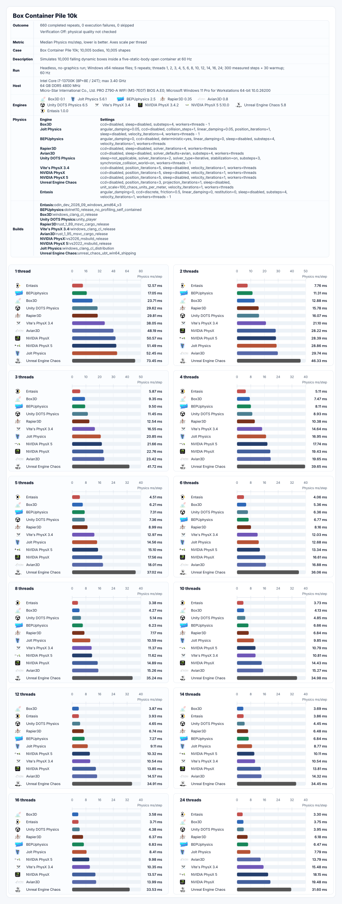
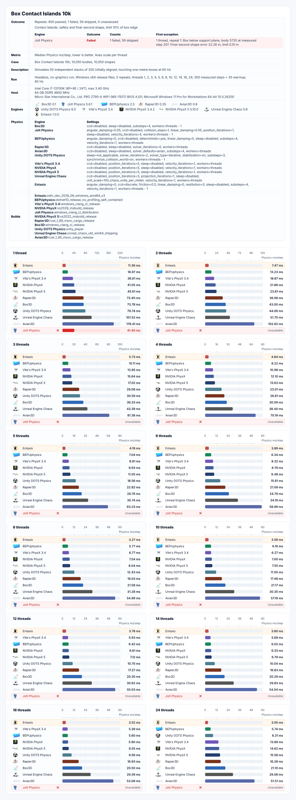
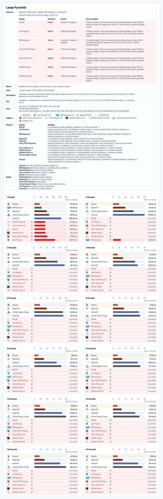
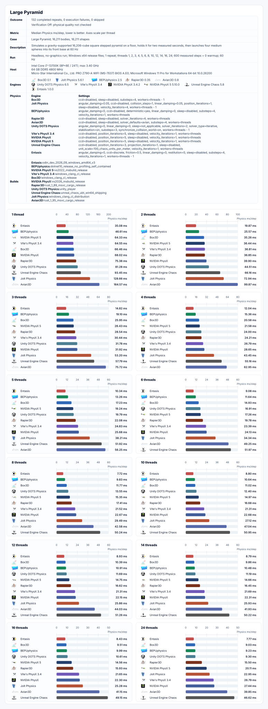

# Physics Arena

Physics Arena compares physics engines on shared scenarios, with timing charts, physical observations and optional saved replays. The Windows x64 application and engine packages are included

## Quick start

Open `PhysicsArena.exe` from the repository root. No engine build or editor is needed. The Microsoft Visual C++ x64 runtime and an OpenGL 3.3-capable graphics driver are required, as listed in [runtime requirements](SOURCES.md#runtime-requirements)

1. In **Run**, choose a case, engines, thread counts and repeats. The default is Box Container Pile 10k. **Shape** stays locked
2. Review **Simulation** and **Fixture**, or open **Configuration** in a compact window. Optionally enable **Save replay** and choose **Replay threads**
3. Choose **Test** or **Release** under **Draft output**, then **Start benchmark**. To run several drafts, use **Add to queue** and **Start queue (N)**
4. Open the saved result in **Results**. In **Recordings**, select a tuple and **Play selected recording** to open Replay

**Test** writes to `results/local/<case>/<cpu>/<run>/`, excluded from Git. **Release** writes to `results/<case>/<cpu>/<run>/`. Both use the same settings and appear in Results. Opening the app starts no benchmark

## Command line

Run these examples from Command Prompt in the repository root. In PowerShell, prefix the executable with `.\`. `run` starts automatically and writes Test output. Recording defaults to Off, independently of the GUI preference

```text
PhysicsArena.exe run box-container-pile-10k --engine box3d --repeats 1
PhysicsArena.exe run box-container-pile-10k --engine bepuphysics2 --engine joltphysics --max-thread-count 4 --repeats 3
PhysicsArena.exe run box-container-pile-10k --engine box3d --thread-count 1 --repeats 1 --timestep-hz 120 --warmup-steps 0 --measured-steps 360 --solver box3d:substeps=2
PhysicsArena.exe run box-container-pile-10k --engine box3d --thread-count 1 --repeats 1 --record-replay on
PhysicsArena.exe replay --result results/local/<case>/<cpu>/<run> --engine box3d --thread-count 1 --repeat-index 0
PhysicsArena.exe report results/local/<case>/<cpu>/<run>
PhysicsArena.exe index
PhysicsArena.exe help
```

Replace `<case>/<cpu>/<run>` with the saved result path shown by the application

## Command forms

| Command                                                                                            | What it does                                                                                                        |
| :------------------------------------------------------------------------------------------------- | :------------------------------------------------------------------------------------------------------------------ |
| `PhysicsArena.exe` or `PhysicsArena.exe help`                                                      | Opens Run without starting work                                                                                     |
| `PhysicsArena.exe run <case-slug> ...`                                                             | Validates and starts the selected benchmark                                                                         |
| `PhysicsArena.exe replay --result <directory> --engine <id> --thread-count <n> --repeat-index <n>` | Opens the exact saved recording without physics. CLI repeat indexes start at 0, while the GUI labels repeats from 1 |
| `PhysicsArena.exe report <directory>`                                                              | Opens the selected saved result                                                                                     |
| `PhysicsArena.exe index`                                                                           | Opens the results library                                                                                           |

Current public case slugs:

```text
box-container-pile-10k
box-contact-islands-10k
spatial-query-trace
ragdoll-stair-tumble
large-pyramid-16206
pyramid-wall-4095
ray-tracing-heavy
```

Container, Spatial Query and Ragdoll support Authored, Sphere, Capsule and Convex Hull. Append `-sphere`, `-capsule` or `-convex-hull` to select a variant. Contact Islands, Large Pyramid, Pyramid Wall and Heavy Ray Tracing support Authored only. The catalog has 16 selections

Large Pyramid is a square stepped structure with projectiles. Pyramid Wall is a one-cube-deep triangular stack without projectiles. Heavy Ray Tracing measures native ray queries over a mixed primitive/mesh scene, with phase timings, capability outcomes and optional saved hit images. See [fixture and measurement details](SOURCES.md#pyramid-wall-and-heavy-ray-tracing)

Contact Islands starts with 50 independent stacks of aligned one-metre cubes touching on every axis, with eight layers per stack. Retired shape results remain readable. Their replays require saved configuration and recordings

## Case authoring

[config/cases.json](config/cases.json) owns case descriptions, schedules, thread counts, geometry, materials, queries and expected observations. Schema 5 is required. Restart the application after editing it, and advance `fixture_revision` when changing a fixture before publication

To add a case using an existing `fixture_semantic` and fields, add its entry to `config/cases.json` and its authored ID to each supporting engine's `supported_case_families` in `config/engines.json`. A new semantic also needs host serialization and a registry adapter in each supporting engine. The host supplies one validated snapshot. Keep JSON loading in the host and derive body transforms in the adapters

Timing, gravity, geometry, density and initial conditions are shared. Each engine owns its friction, restitution, sleeping, continuous collision detection (CCD) and native solver settings. Ragdoll damping also belongs to each engine. Engine reset restores that engine's benchmark defaults, while **Reset physics** restores all physics and shared fixture defaults. Neither changes the selected engines, thread counts or repeats

`--physics` fields are `friction`, `restitution`, `sleep_mode=enabled|disabled`, `continuous_collision_mode=enabled|disabled`, Ragdoll-only `linear_damping` and `angular_damping`, and Unity-only `solver_stabilization=enabled|disabled`. Repeat assignments for distinct engine/field pairs, for example `--physics unity_physics:solver_stabilization=disabled`. Unknown, duplicate, unselected or unsupported assignments fail before a producer starts

Unity DOTS Physics has no sleeping facility or selectable swept-CCD mode. Its predictive contacts remain active, contact stabilization defaults to On and synchronization stays On. BEPU has no stock restitution coefficient. Entasis supports restitution and native sleeping in every supported dynamics case

Chaos Ragdoll damping uses native coefficients. BEPU damping is velocity loss per second, with values above one saturating. BEPU CCD Off selects Passive and On selects Continuous. Jolt On selects translational Linear cast. Avian On sweeps static/kinematic targets and Off disables sweeps. Box3D's current non-bullet bodies sweep static targets. PhysX uses native swept CCD

PhysX accepts 1-255 velocity iterations for both 3.4 variants and 0-255 for 5.10. Jolt friction requires 2+ velocity iterations, with lower native-valid values accepted without clamping. Rapier's solver count selects temporal substeps. Native solver counts, damping decay and collision coverage differ across engines

GUI edits are saved with the result as a **Custom** configuration. Spatial Query and Heavy Ray Tracing have no dynamics frequency or solver controls

## Arguments

| Argument                         | Command    | Meaning                                                                                                                                       |
| :------------------------------- | :--------- | :-------------------------------------------------------------------------------------------------------------------------------------------- |
| `--engine <id>`                  | `run`      | Select an engine. Repeat for multiple engines                                                                                                 |
| `--engine-set <set>`             | `run`      | Select a configured engine set, default `default_release`                                                                                     |
| `--thread-count <n>`             | `run`      | Select an exact count within case, host and engine limits. Repeat for multiple counts                                                         |
| `--max-thread-count <n>`         | `run`      | Use configured counts up to `n`, filtered by host and engine support. Cannot combine with `--thread-count`                                    |
| `--record-replay on\|off`        | `run`      | Save recordings for all selected threads. Default Off                                                                                         |
| `--verify on\|off`               | `run`      | Collect and assess physical quality. Default On. Completed Off repeats are unverified                                                         |
| `--repeats <n>`                  | `run`      | Repeats per engine/thread pair. Defaults to 5 for all cases except Heavy Ray Tracing, which uses 3                                            |
| `--timestep-hz <n>`              | `run`      | Positive dynamics frequency, unavailable for query cases                                                                                      |
| `--warmup-steps <n>`             | `run`      | Warmup work units, including zero                                                                                                             |
| `--measured-steps <n>`           | `run`      | Positive measured work units                                                                                                                  |
| `--solver <engine:field=value>`  | `run`      | A supported native solver setting for a selected engine. Repeat for distinct fields                                                           |
| `--physics <engine:field=value>` | `run`      | Per-engine friction, restitution, sleep or CCD. Ragdoll also accepts linear/angular damping, Unity dynamics also accepts solver stabilization |

Engine IDs in the default release set:

```text
box3d joltphysics bepuphysics2 rapier3d avian3d unity_physics physx34 nvidia_physx34 nvidia_physx5 unreal_chaos entasis
```

Box3D supports all 16 selections. Entasis supports 12, excluding Ragdoll. The other nine engines support all families except Heavy Ray Tracing, including their supported shape variants, for 15 selections each. Default engine selection filters unsupported pairs, while an explicit unsupported request fails. [config/engines.json](config/engines.json) owns this support map

## Generated files

Each completed result directory contains the following files where applicable:

| File or folder                                               | Contents                                                                                                                                      |
| :----------------------------------------------------------- | :-------------------------------------------------------------------------------------------------------------------------------------------- |
| `manifest.json`                                              | Frozen shared fixture and per-engine physics/solver settings, engine, host, tuple identities, recording declaration and release-file snapshot |
| `raw/<engine>/t<thread-count>/`                              | Raw per-engine CSV files used to build the result                                                                                             |
| `replays/<engine>_t<thread-count>_r<repeat-index>.bpr`       | Optional scene and every saved frame for one opted-in tuple                                                                                   |
| `normalized.csv`                                             | Per-repeat measurements in a common schema                                                                                                    |
| `summary.csv`                                                | Aggregated rows by engine and thread count                                                                                                    |
| `observations.csv`                                           | Expected values, measured observations and outcomes                                                                                           |
| `stability.csv`                                              | Compact physical assessments, sample coverage, first breaches, extrema and verification overhead                                               |
| `summary.svg`                                                | Summary chart                                                                                                                                 |
| `step-timing.csv`                                            | Ordered complete native-work durations for timed cases                                                                                        |
| `step-timing.svg`                                            | Work-unit timing chart for timed cases                                                                                                        |
| `report.md`                                                  | Human-readable measurements, settings and outcomes                                                                                            |
| `ray-tracing.csv`, `ray-capabilities.csv`, `ray-process.csv` | Heavy Ray Tracing phase timings, capability probes and peak process committed bytes                                                           |
| `ray-corpus/`, `ray-images/*.rth`                            | Shared ray inputs and optional compressed native-hit recordings                                                                               |

## Latest Release results

October 5, 2026: Intel Core i7-13700K, 64 GB DDR5-4800, Windows 11. Each run selected 11 engines and a 60 Hz timestep. Five repeats per engine/thread configuration unless stated otherwise

Thread counts: `1, 2, 3, 4, 5, 6, 8, 10, 12, 14, 16, 24`. Charts show native step timings alongside physical outcomes

### Box Container Pile 10k



660 completed repeats with verification Off, physical quality unverified. [Full report](results/box-container-pile-10k/intel-core-i7-13700k/2026-10-05_0700_ddr5-4800_threads-1-2-3-4-5-6-8-10-12-14-16-24_r5/report.md)

### Box Contact Islands 10k



600 physical passes, 1 physical failure and 59 skipped repeats. [Full report](results/box-contact-islands-10k/intel-core-i7-13700k/2026-10-05_0800_ddr5-4800_threads-1-2-3-4-5-6-8-10-12-14-16-24_r5/report.md)

### Large Pyramid 16,206 (verification On)



245 physical passes, 7 physical failures and 408 skipped repeats. [Full report](results/large-pyramid-16206/intel-core-i7-13700k/2026-10-05_0940_ddr5-4800_threads-1-2-3-4-5-6-8-10-12-14-16-24_r5/report.md)

### Large Pyramid 16,206 (verification Off)



132 completed repeats with verification Off, physical quality unverified. One repeat per engine/thread configuration. [Full report](results/large-pyramid-16206/intel-core-i7-13700k/2026-10-05_1700_ddr5-4800_threads-1-2-3-4-5-6-8-10-12-14-16-24_r1/report.md)

## Notes

- [Configuration and queue](docs/USAGE.md#configuration-and-queue): presets, recommendations, cancellation and failed runs
- [Saved results and replay](docs/USAGE.md#saved-results-and-replay): playback, comparison, recording storage and recovery
- [Physical verification](docs/USAGE.md#physical-verification): quality criteria, timing boundaries and historical results

## Sources

- [User guide](docs/USAGE.md): configuration, replay and physical verification
- [Changelog](CHANGELOG.md): ports, removals, new benchmarks and application features
- [SOURCES.md](SOURCES.md): runtime requirements, pinned dependencies, licenses and measurement details
- [Entasis adapter](src/entasis/README.md): case support, lifecycle and timing boundaries
- [Benchmark results](results/README.md): selected publications and their reports
